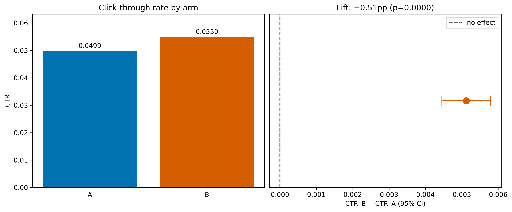
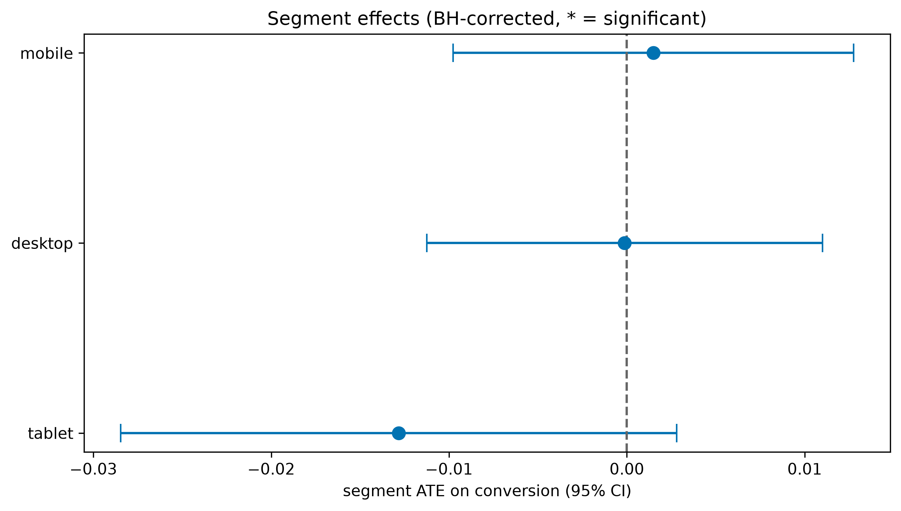
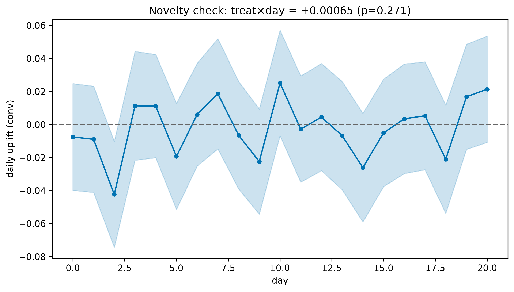

# A/B Experiment Report (synthetic demo)

- **Users:** 42,000 (21,021 treatment / 20,979 control)
- **Window:** 21 days
- **Decision metric:** CTR (ratio), secondary: conversion

## 1. Sample Ratio Mismatch
- Observed: A=20979, B=21021, p=0.8376
- Detected: False

## 2. CUPED variance reduction
- SE naive: 0.00360 → SE CUPED: 0.00327
- Variance reduction: 17.7%

## 3. Decision metric (delta-method CTR)
| | CTR_A | CTR_B | diff | p | sig |
|---|---|---|---|---|---|
| CTR | 0.0499 | 0.0550 | +0.00512 | 0.0000 | True |

## 4. Segment heterogeneity (BH-corrected)
| segment | ATE | p_adj | significant |
|---|---|---|---|
| mobile | +0.0015 | 0.9821 | False |
| desktop | -0.0001 | 0.9821 | False |
| tablet | -0.0128 | 0.3224 | False |

## 5. Novelty / primacy
- treat:day = +0.00065 (p=0.2714)
- Diagnosis: no significant time trend -> stable effect (or no effect)

## 6. Conclusion
- PASS: traffic split matches the intended ratio.
- CTR lift 0.51pp is significant (p=0.000).
- No significant segment heterogeneity after BH correction.
